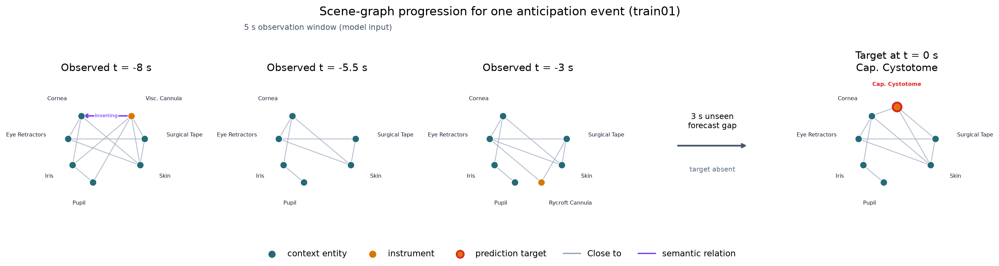
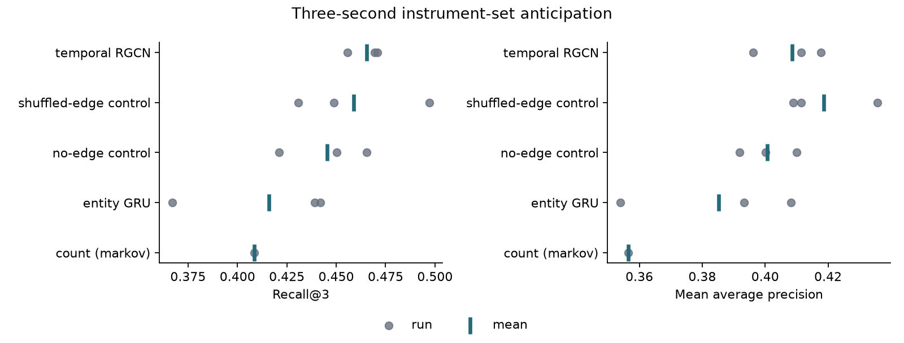

# Relational representations for next-instrument anticipation

Surgical assistance systems must anticipate an instrument before it is needed, not merely
recognise it once it appears. This controlled public-data study examines how a dynamic
surgical scene-graph model compares with sequence models that use recent entity history.

The project is motivated by MITI's work on instrument anticipation, multimodal graph
representations and surgeon-specific adaptation. It uses the public CAT-SG annotations to
explore one deliberately narrow representation question. It is not a reproduction or
assessment of MITI's in-house data, models or robotic system, and it is not evidence for
clinical deployment.

## Question

> At a fixed three-second prediction horizon, do scene-graph relations improve prediction of
> the next appearing instrument set beyond instrument-presence history alone?

An anticipation event contains the set of confirmed instrument onsets at one timestamp after
each target has been absent for the complete observation and forecast interval. The model
observes five seconds of history, ending three seconds before the event. Onsets must persist
in at least three of the next five annotations. This prevents every target from appearing in
the input while retaining coordinated multi-instrument events.



*A real training event reconstructed from JSON annotations. The first three panels show
scene-graph progression during the five-second observation window; after a three-second
unseen gap, the target instrument appears at onset. Node positions are held fixed across
panels for readability and do not encode image geometry.*

## Study design

All conditions use the same event definitions, procedure-level splits, training budget and
random seeds.

| Condition | Information available |
|---|---|
| Frequency / Markov | Population and recent instrument-transition frequencies |
| Entity GRU | Five seconds of entity-presence history, without relations |
| Temporal GNN | The same entities plus geometric and semantic relations |
| No-edge control | The graph architecture and entity inputs, but no relation edges |
| Shuffled-edge control | Relation counts and types retained, but endpoints shuffled within each frame |

Primary metrics are recall at one, recall at three and sample-averaged mean average
precision. Results are reported over three fixed seeds. The official CAT-SG split is
preserved at procedure level: 25 training, 5 validation and 20 test procedures. The full
comparison is repeated on singleton-only events as a sensitivity analysis.

The primary comparison is **Temporal GNN versus Entity GRU**. The no-edge control tests
additional model capacity; the shuffled-edge control tests whether correct relational
topology matters beyond relation counts and types.

## Results

Mean held-out performance is reported across seeds 7, 21 and 73 (the deterministic count
baseline is fitted once).

| Condition | Recall@1 | Recall@3 | mAP |
|---|---:|---:|---:|
| Markov count baseline | 0.152 | 0.409 | 0.357 |
| Entity GRU | 0.215 | 0.416 | 0.385 |
| No-edge control | 0.222 | 0.446 | 0.401 |
| Shuffled-edge control | 0.241 | 0.459 | 0.419 |
| Temporal RGCN | 0.223 | 0.465 | 0.409 |

The temporal RGCN produced higher point estimates than the entity GRU by 0.049 Recall@3 and
0.023 mAP. Paired hierarchical 95% bootstrap intervals over test procedures and training
seeds included zero (-0.008 to 0.115 and -0.013 to 0.062, respectively), while the no-edge
and shuffled-edge controls remained close to the full model. Within this setup, the
topology-specific contribution therefore could not be isolated. The singleton-only
sensitivity analysis produced the same ordering.

This conclusion is intentionally local to the dataset, event definition, horizon and model
used here. CAT-SG supplies idealised annotations from a highly standardised procedure; it
does not provide the multimodal real-time signals, surgeon identity or clinical context for
which richer graph representations are designed.



*Grey circles are individual runs; teal markers are condition means. The deterministic
Markov baseline is fitted once.*

Machine-readable outputs: [model comparison](results/02_model_comparison.csv) and
[bootstrap intervals](results/02_bootstrap_intervals.csv).

## Relation to MITI and follow-up question

Scene graphs are a natural representation for combining heterogeneous entities, actions,
spatial relationships and data modalities in an operating room. The MITI studies cited
below pursue that substantially richer setting. This experiment instead isolates a small
part of the problem with public annotations and demonstrates a controlled comparison using
no-edge and shuffled-edge conditions.

The most informative follow-up is not a broader claim for or against graphs, but a more
targeted question:

> Under which surgical conditions and with which modalities do structured relational
> representations provide information complementary to procedural history and
> surgeon-specific preferences?

One hypothesis raised by the results is that relational context may be most informative at
locally ambiguous transitions, while routine transitions are already captured by sequence
priors. Testing that hypothesis would require richer data and clinical context and is beyond
the scope of this repository.

## Scope

This repository deliberately studies one question at one prediction horizon. The following
are valuable extensions, but not part of the primary experiment:

- surgeon-specific personalisation;
- multiple anticipation horizons;
- phase-specific or technique-specific analysis;
- prediction timing, abstention and premature robotic actions;
- learning scene graphs directly from video.

## Notebooks

| Notebook | Purpose |
|---|---|
| [Task definition and dataset audit](notebooks/01_task_definition_and_dataset_audit.ipynb) | Audit CAT-SG, define anticipation events using training data only, and freeze the evaluation cohort. |
| [Relational model comparison](notebooks/02_relational_model_comparison.ipynb) | Train the baselines and graph model, run both topology controls, and report the predefined comparison with uncertainty. |

The notebooks are written as concise, executable narratives. Findings are added only after
the corresponding experiment has been run.

## Data

[CAT-SG](https://github.com/felixholm/CAT-SG) contains frame-level entities, geometric and
semantic relations, positions, sizes, surgical steps and technique labels for 50 cataract
procedures. Its annotations are released under CC BY-NC 4.0.

CAT-SG distributes the scene-graph annotations as JSON files. Each file corresponds to a
CATARACTS video and each record to an annotated frame; the matching videos are accessed
separately under their own conditions. This project deliberately uses only the annotations,
which is why no surgical images appear in `data/`.

The dataset is not redistributed by this repository. Clone or copy CAT-SG's downloaded
annotation files to:

```text
data/annotations/all/
data/annotations/splits/
```

`data/` is gitignored. The underlying surgical videos are not required.

## Running

Dependencies are managed with [uv](https://docs.astral.sh/uv/):

```bash
uv sync --locked
uv run jupyter lab notebooks/
```

To reproduce the committed outputs non-interactively:

```bash
uv run jupyter nbconvert --to notebook --execute --inplace notebooks/01_task_definition_and_dataset_audit.ipynb
uv run jupyter nbconvert --to notebook --execute --inplace notebooks/02_relational_model_comparison.ipynb
```

The repository includes the executed notebooks, figures and compact result files, but not
data or trained model weights.

## Repository layout

```text
.
├── notebooks/     # narrative analysis and experiment
├── figures/       # figures used in the write-up
├── results/       # compact machine-readable results
├── data/          # local CAT-SG annotations; gitignored
├── pyproject.toml
├── uv.lock
└── README.md
```

## References

- Holm et al. *CAT-SG: A Large Dynamic Scene Graph Dataset for Fine-Grained Understanding
  of Cataract Surgery.* MICCAI 2025. [DOI](https://doi.org/10.1007/978-3-032-05114-1_10)
- Wagner et al. *Robotic scrub nurse to anticipate surgical instruments based on real-time
  laparoscopic video analysis.* Communications Medicine, 2024.
  [DOI](https://doi.org/10.1038/s43856-024-00581-0)
- Wagner et al. *Towards multimodal graph neural networks for surgical instrument
  anticipation.* IJCARS, 2024. [DOI](https://doi.org/10.1007/s11548-024-03226-8)
- Wagner et al. *Modeling surgeon-specific instrument usage profiles to improve instrument
  anticipation.* Proc AUTOMED, 2026.
  [DOI](https://doi.org/10.18416/AUTOMED.2026.2482)
